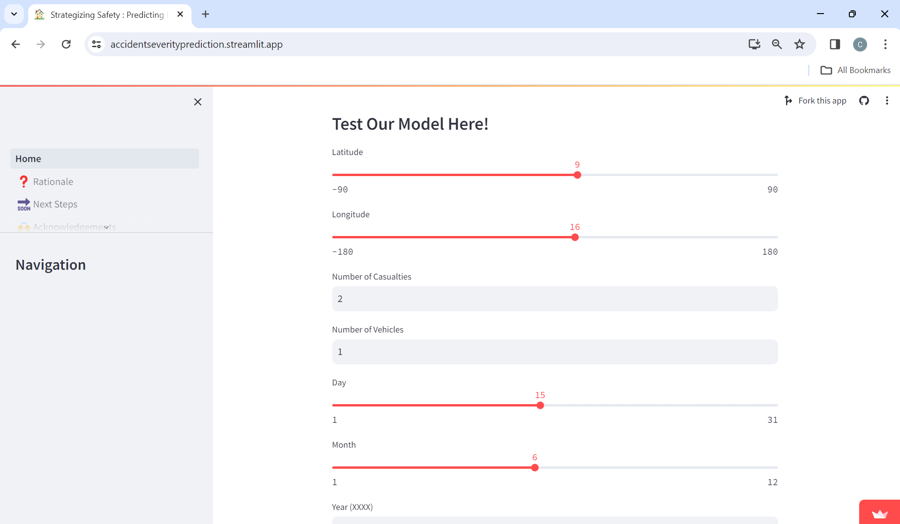
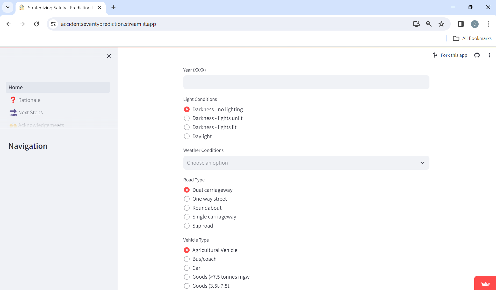
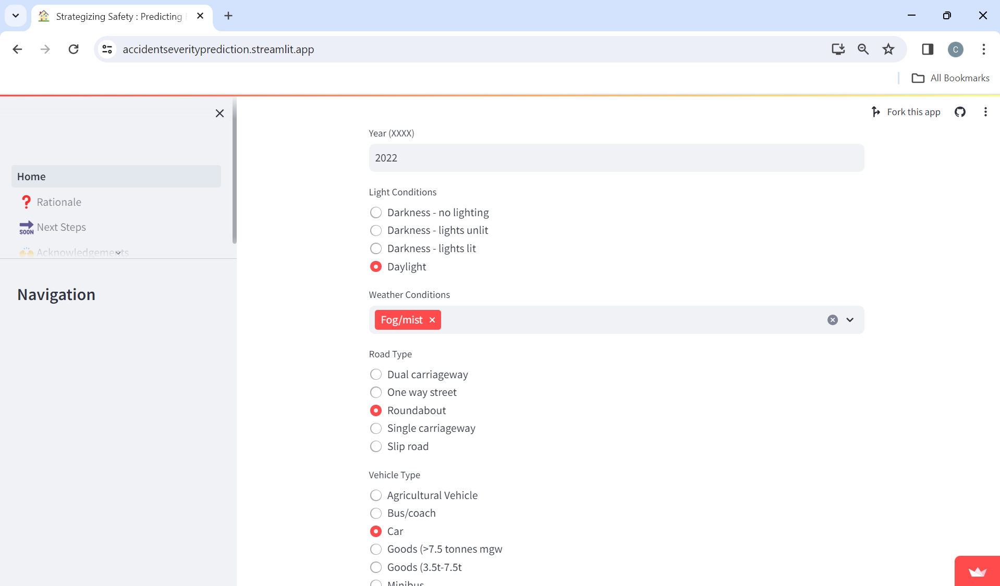
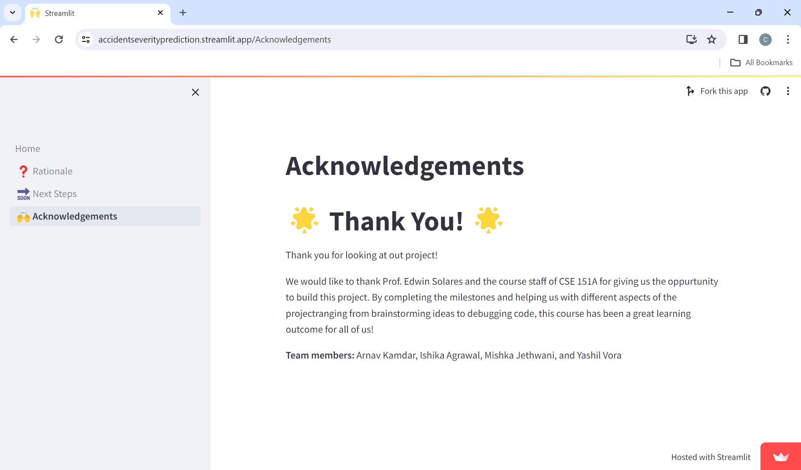
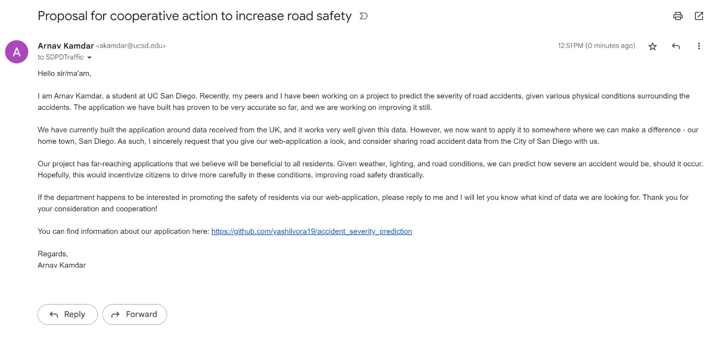
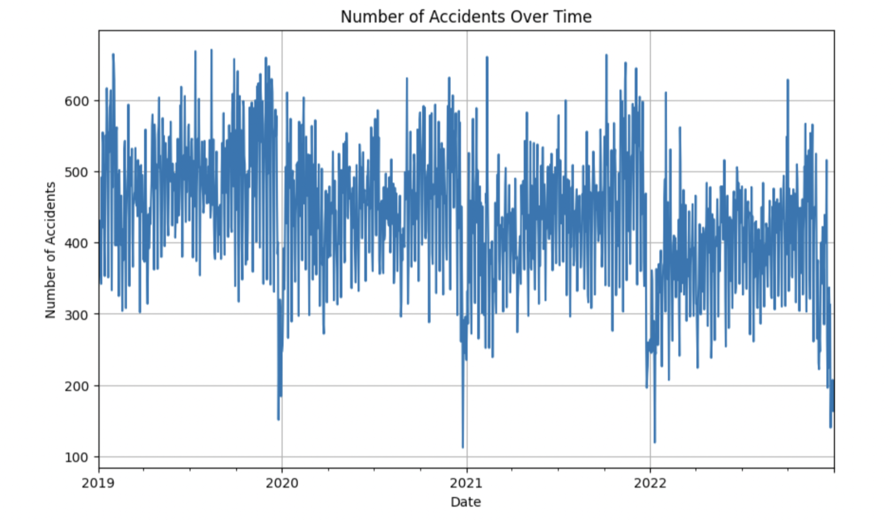
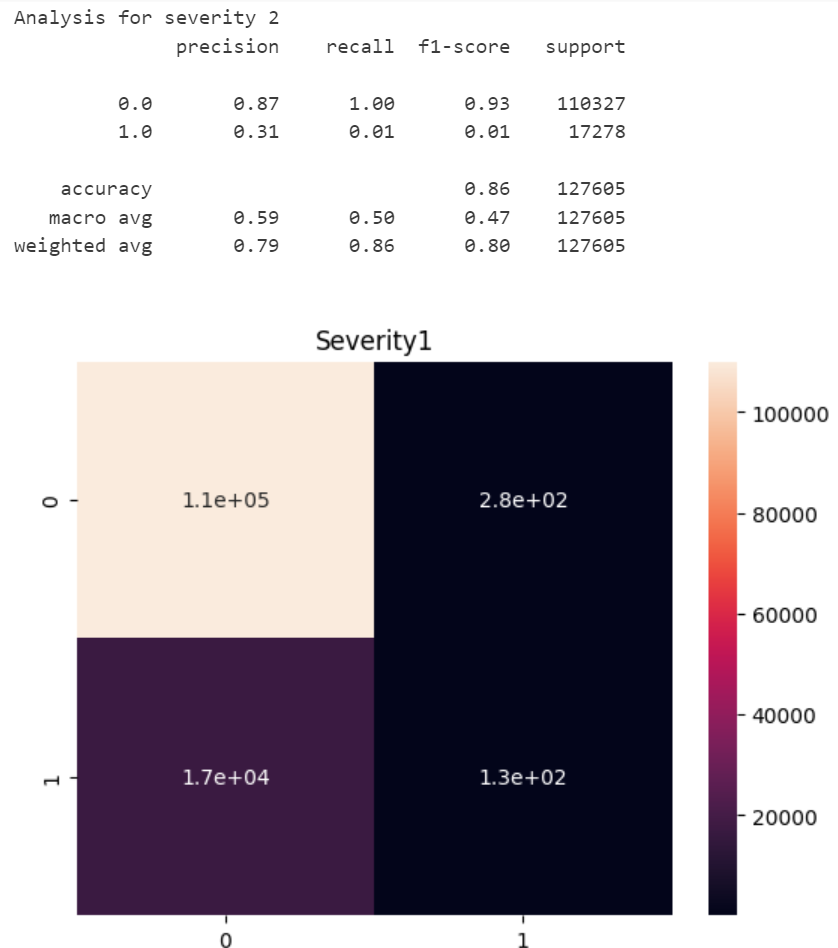
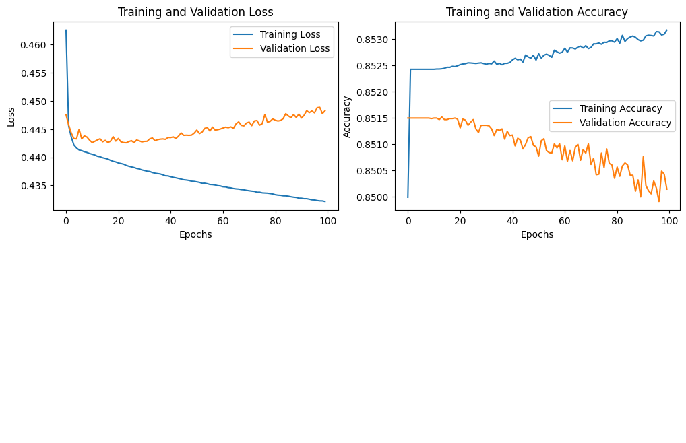
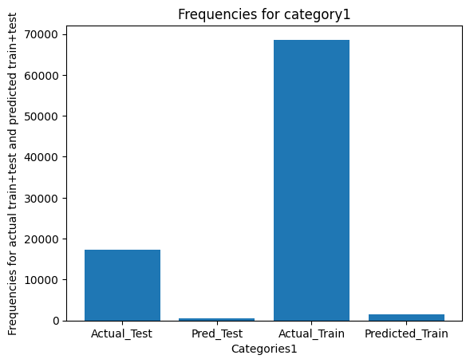

    
  &nbsp;&nbsp;&nbsp;  
     
  &nbsp;&nbsp;&nbsp;
  
  
  &nbsp;&nbsp;&nbsp;
  
  &nbsp;&nbsp;&nbsp;
    

  

  
  &nbsp;&nbsp;&nbsp;
  
  &nbsp;&nbsp;&nbsp;
  

# Strategizing Safety : Predicting Road Accident Severity for Effective Prevention

# Members
Arnav Kamdar,
Ishika Agrawal,
Mishka Jethwani,
Yashil Vora

## Table of Contents

- [**Introduction**](#introduction)

- [**Try The Model On Our Webapp**](#try-the-model-on-our-webapp)

- [**Methods**](#methods)
    - [Data Exploration](#data-exploration)
    - [Preprocessing Steps](#preprocessing-steps)
    - [Model 1: Logistic Regression](#model-1-logistic-regression)
    - [Model 2: Neural Networks](#model-2-neural-networks)
    - [Model 3: Support Vector Machines](#model-3-svms)

- [**Results**](#results)
    - [Data Exploration](#data-exploration-results)
    - [Preprocessing Steps](#preprocessing-results)
    - [Model 1: Logistic Regression](#model-1-logistic-regression-results)
    - [Model 2: Neural Networks](#model-2-neural-network-results)
    - [Model 3: Support Vector Machines](#model-3-svms-results)

- [**Discussion**](#discussion)
    - [Data Exploration](#data-exploration-discussion)
    - [Preprocessing Steps](#preprocessing-discussion)
    - [Model 1: Logistic Regression](#model-1-logistic-regression-discussion)
    - [Model 2: Neural Networks](#model-2-neural-network-discussion)
    - [Model 3: Support Vector Machines](#model-3-svms-discussion)

- [**Conclusion**](#conclusion-and-future-steps)

## Introduction

One of the leading causes of non-natural death is road accidents. There may be several contributing factors that lead to vehicle casualties, including traffic, weather, and road conditions. We wanted to predict the severity of road accidents, classifying them from Mild, Serious, or Fatal using supervised models such as Logistic Regression, SVMs, Neural Nets, Decision Trees, and more. To predict the data, we consider attributes such as road conditions, weather conditions, vehicle types, or geographical location. 

Our data is primarily focused on locations in the United Kingdom, so while it may not necessarily apply to the United States, we believe that this model may still useful when run on US datasets. The dataset we use has 14 columns and over 600k observations, with columns including severity of accident, the date, number of casualties, longitude,  latitude, road surface conditions, road types, urban/rural areas, weather conditions, and vehicle types.

There are some ethical concerns posed with this model - if our stakeholders were vehicle companies, would they have reduced sales if, say, trucks were more likely to lead to severe accidents? However, by figuring out what would predict the severity of road accidents, we can also prevent harm by noting the features that largely impact the severity. The aim with this project is to advise people when conditions are likely to get them into more extreme car crashes.

## Try The Model On Our Webapp!

To take our step one project ahead, we decided to deploy our model on a webapp that can be used by anyone to test it out!

Additionally, we also sent an email to the San Diego Police Department (SDPD) to express our goal of improving road safety in San Diego and requested access to data regarding accidents documented over the past years.

Our webapp is live on this [link](https://accidentseverityprediction.streamlit.app/)!

Feel free to look at our rationale and next steps for this project in more detail and try out our model by playing around with the different parameters!

Here are a few screenshots of our website:

Here is a screenshot of our email to SDPD:

We deployed this model to a webapp using Streamlit. Streamlit is a Python library made specifically for deploying ML models to websites to display the work of the people building it and allowing users to test it out! We hope you enjoy looking at our work and help us make this model better!

## Methods

### Data Exploration 
#### Visualization Steps

To get an overall sense of the distribution of the data, we made use of a pairplot and heatmap using a correlation matrix. Through this we were also able to get correlations between different features, giving us a much better insight into the different features' interrelations.

Given a much stronger idea of what the data looks like, we now had a better perspective on which models to use in the next steps of this project. 

We then plotted different types of graphs to gain a deeper understanding of our data and compare different attributes effectively. The different graphs we plotted were

1. Accidents vs Light Conditions
2. Accidents vs Time
3. Number of Vehicles vs Number of Casualities

### Preprocessing Steps
Our work done can be found in the notebook `Data_Cleaning_and_EDA_Final.ipynb`. Here is the link to this [notebook](https://github.com/yashilvora19/accident_severity_prediction/blob/main/Data_Cleaning_and_EDA_Final.ipynb).

Our first step in preprocessing the data was dropping rows with null values. We found that of all the rows in our data, this proved a negligible number, so we decided to drop this data with the confidence that it would have no tangible effect on the output of our model. We continued preprocessing the data by one-hot encoding most of the categorical data (`Road_Surface_Conditions`, `Road_Type`, `Urban_or_Rural_Area`, `Vehicle_Type`). For the `Light_Conditions` attribute, we chose an ordinal approach, encoding it from 0, for Dark, to 3, for Daylight. We selected a MultiBinarizer to conduct multiple one-hot encoding for each row under `Weather Conditions` as multiple categories could be satistified simultaneously. Then we chose to normalize the `Latitude` and `Longitude` to make it a more standardized value. We left the `Number_of_Casualties` and `Number_of_Vehicles` columns as they were, as the values were just integers and seemed to have no large outliers.

### Model 1: Logistic Regression

Our work done for this model can be found in the jupyter notebook `Milestone_3.ipynb`. Here is the link to this [notebook](https://github.com/yashilvora19/accident_severity_prediction/blob/main/Milestone_3.ipynb).

#### Logistic Regression
In our project, we are trying to classify accidents into the following categories:
1. Mild
2. Severe
3. Fatal

Since this is a classification task, we chose logistic regression as our first machine learning model.

Our model analyses the given data (42 columns) and outputs 0 if the accident is classified as 'slight', 1 if it is 'serious', and 2 if it is 'fatal'. We use multiclass logistic regression since there are more than 2 labels. 

### Model 2: Neural Networks

Our work done can be found in the jupyter notebook `Milestone_4.ipynb`. Here is the link to this [notebook](https://github.com/yashilvora19/accident_severity_prediction/blob/main/Milestone_4.ipynb).

For this milestone, we decided to run a Neural Network on our data. The aim is to get a model that works at a better accuracy than our previous logistic regression model, since the last one had some drawbacks as discussed below. Additionally, we want to ensure that all three classes are being predicted in our output (more discussion below).  

#### Neural Network: 
In the Neural Network we created, we used the following specifications and parameters:
- 4 layers 
- Sigmoid activation functions in hidden layers 
- Softmax activation function in output layer
- Adam optimizer
- Sparse categorical crossentropy loss 

### Model 3: SVMs

For the next step of our project, we will be leveraging a Support Vector Machine (SVM) model to train on our data and try implementing a few machine learning techniques in order to boost the accuracy.

## Results

### Data Exploration Results
Through the heatmap and pair-plot we had decided to plot, we were able to see trends and patterns. These were corroborated by a few more visualizations of specific trends: light intensities vs number of accidents, number of casualties vs number of vehicles, and number of accidents vs time (over a span of 4 years). 

The pair-plot we created is given below. Through this pairplot, we can see the clear relation between latitude and longitude since the data maps out across the United Kingdom.
We can also observe no significant correlation between the year and number of casualties, discussed later below. There also seem to be correlations between the latitude/longitude and the number of casualties/accidents. 

Next, we plotted a heatmap - we can see that the highest correlation coefficient that Accident Severity has is with Number of Casualties, at 0.088 . 

Other graphs that we plotted are given below: 

1. Accidents vs Light Conditions
We can see that the maximum number of accidents happen in the daylight.

3. Accidents vs Time
Number of accidents seem to be similar in all the years for similar periods across the year.

4. Number of Vehicles vs Number of Casualities
Through this, we can see that greater the number of vehicles we have, more the casualties. This is another useful inference which gives us an indication about how the data is correlated.

### Preprocessing Results

#### Categorical Features
Categorical features which were one-hot encoded to convert them into numerical representations include `Road_Surface_Conditions`, `Road_Type`, `Urban_or_Rural_Area`, and `Vehicle_Type`. This conversion was necessary to incorporate these features into machine learning models effectively.

`Light_Conditions`, while also a categorical feature, was treated as ordinal and encoded from 0 to 3 to preserve the inherent order in its categories.

To handle the `Weather_Conditions` feature, which could have multiple categories per row, we utilized the MultiBinarizer technique. This allowed us to represent each weather condition as a binary feature, facilitating its inclusion in the analysis.

#### Numerical Features

The `Latitude` and `Longitude` features were normalized to ensure that their magnitudes did not unduly influence the machine learning algorithms. Normalization was performed by subtracting the mean and dividing by the standard deviation of each feature.
Before normalization, summary statistics such as mean and standard deviation were calculated for these features to provide insights into their distributions and the extent of scaling required.

#### Feature Retention

The features `Number_of_Casualties` and `Number_of_Vehicles` were left unchanged during preprocessing. This decision was made based on their inherent numerical nature and relevance to the study objective. These features were considered essential for predicting accident severity and were thus retained without transformation.

### Model 1: Logistic Regression Results
Further evaluations on the performance of the model have been done within the file labelled `Milestone 3.ipynb`.
The accuracy of our Logistic Regression model, came out to be 85.19%, 85.14% and 85.26% for our Training, Testing and Validation data. Other parameters such as recall, precision and support can be seen below in the classification reports.

We also plotted the frequency of our actual and predicted values. The reason for this will become clear when we analyze our data.

Finally, we plotted a scatter plot for our coefficients, to display which coefficients have the most bearing on the output. 

Since all 3 accuracies are close to each other (around 85%), and simultaneously the mean squared error is also close (around 0.18), we can say that there is no major underfitting or overfitting that can be observed.

### Model 2: Neural Network Results

The accuracy of our Neural Network model, came out to be 85.3%, 85.05% and 85.1% for our Training, Testing and Validation. Other parameters such as recall, precision and support can be seen below in the classification reports.

Classification report and confusion matrix for the 'Mild' severity class.

Classification report and confusion matrix for the 'Severe' severity class.

Classification report and confusion matrix for the 'Fatal' severity class.

Following are the results we found, plotted as graphs: 

Additionally, in our previous work we found that a Logistic Regression fails to classify values into all three classes. We wanted to check if this was the issue here as well, so we plotted out our frequencies for actual and predicted values for each class as shown:

All 3 accuracies appear to be close to each other (around 85%). However, looking at the graph for validation accuracy, we see that it is gradually decreasing across epochs. This shows signs of minor overfitting, but since the overall accuracy drops by a very low percentage, it can be neglected.

### Model 3: SVMs Results

For the next step of our project, we decided to run an SVM model. For this, we tried a variety of strategies 

## Discussion

### Data Exploration Discussion 
For this we decided to start with a heatmap and a pairplot to get a basic understanding of how the data is. After generating the pairplot we found that there is a clear relation between latitude and longitude. Further, we can also see a correlation between year and number of casualties, since the number of casualties decreases per year. As shown above, there also seems to be correlations between the latitude and longitude and the number of casualties/accidents. This could indicate that some regions in UK have more accidents and more work needs to be done there. This includes lack of traffic signals, poor road safety, or just rash drivers breaking speed limits. 

Next, by generating a heatmap we came to the concusion that  there is an extremely low correlation between Accident Severity and all other columns. As seen earlier,  the highest correlations is with Number of Casualties, at 0.088. However, it should be noted that this doesn't mean that there isn't a connection between our input and output - multiple features may be simultaneously influencing the output.

After plotting the basic graphs we wanted to explore the data more so we decided to plot some more graphs and found three to have very intresting insights. 
1. Accidents vs Light Conditions: 
Intuitively, we would have thought that a lot of accidents happen during the darkness. However, through this barplot, this is false. The maximum number of accidents happen in the daylight as we have seen earlier. A possible reason for this could be that the number of drivers during the day is much higher, so statistically the number of accidents will also be higher.

2. Accidents vs Time: 
We saw that there is not much variance in the accidents that happen through the years. While, there are some timings during the year that have had more accidents these seem to be repeating. A possible reason of this could be more people going out dueing vacations, increase in activity during festivals etc. However, there is no change in the number of accidents over the years this shows that no significant improvements have been made recently to make it safer and prevent accidents making this project even more important.

3. Number of Vehicles vs Number of Casualities: 
Like we would have expected, more the number of vehicles are involved in an accident, more the peeple are at danger ultimately resulting in more casualties.

### Preprocessing Discussion

#### Categorical Features

Encoding categorical features is crucial for machine learning models as they typically require numerical inputs. One-hot encoding allows for the representation of categorical variables without imposing an arbitrary order, while ordinal encoding preserves the order inherent in certain features like `Light_Conditions`.
The use of MultiBinarizer for `Weather_Conditions` was justified due to the presence of multiple categories per row. This approach enabled us to capture the variability in weather conditions without introducing excessive dimensionality into the dataset.

#### Numerical Features

Scaling numerical features is essential to prevent features with large magnitudes from dominating those with smaller magnitudes during model training. Normalization, as applied to `Latitude` and `Longitude`, ensures that all features contribute equally to the learning process, thereby improving model performance.
Normalization of Latitude and Longitude is particularly beneficial from a geographical standpoint, as it allows for more meaningful comparisons between geographical locations.

#### Feature Retention

Retaining `Number_of_Casualties` and `Number_of_Vehicles` without transformation was deemed appropriate due to their direct relevance to the study objective. These features provide crucial information about the severity and complexity of accidents, making them indispensable for predictive modeling.

### Model 1: Logistic Regression Discussion
We performed Standardization on our model before we moved forward with actual model implementation. We chose to use standardization as our preprocessing technique due to the following reasons:
1. Our data didn't follow a normal distribution, hence standardizing it was imperative in order to get accurate results.
2. Maining the relationship between datapoints is also important, and since standardization doesn't distort our data distribution, it works well for preprocessing.
3. Standardization also takes into account outliers, which will again make our model better.

We chose logistic regression because of the following reasons:
1. Simplicity: It's easy to implement, and is also one of the first models we learnt in class. 
2. Efficiency: It is known to be a very popular classification model for categorical data, which is what we are focusing on. It is also very fast.
3. Accuracy: It also provides a probability for each outcome, which makes it easier to understand how confident the model is in its predictions.

Analysis of Results: 
While this would look like the model is performing well on a surface level, if we take a look at the classification reports and the confusion matrix plotted, we can clearly see that there are definitely issues with this model! The recall scores for classes 1 and 2 (or 'Severe' and 'Fatal') accidents are 0. This means that we are rarely predicting those values and 'Mild' accidents are being predicted the most. It is also worth noting that in our dataset, majority of the accidents our mild and this could result in a bias in the data. Due to this bias, it is reasonable to assume that our logistic regression model is biased too and there can be a lot of improvements that can be made here.

### Model 2: Neural Network Discussion

We decided to use a Neural Network as it seemed the logical next step from a regression model, and it can work with classification problems pretty well. Our model analyses the given data (42 columns) and outputs 0 is the accident is classified as 'slight', 1 if it is 'serious', and 2 if it is 'fatal'. We use multiclass classification since there are more than 2 labels. 

Following are some advantages of a Neural Network over the previous models we have considered:
- Neural Networks are able to capture more complicated relationships between non-linear data.
- Having different nodes and activation functions allows us a greater insight into the relationships between variables.
- Neural Networks additionally give us the chance to tune our hyperparameters, allowing us to optimize manually for the greatest efficiency across both training and testing data.

Following are our reasons for choosing the parameters we did in the Neural Network:
- 4 layers: Upon some tuning of the number of layers, we found that 4 layers was the sweet spot between efficiency and output. We also did not want to overfit our training data, so we decided to keep the number of layers relatively low. 
- Sigmoid activation functions in hidden layers: We tuned our hyperparameters to find that this worked best as an activation function in our three hidden layers. A sigmoid activation function is simple enough for efficient runtime, and works well with classification problems. Our hidden layers have 64, 32, and 16 units respectively, to allow the data to scale down for our final output layer. 
- Softmax activation function in output layer: Since our output is a multinomial classification, we found that softmax was the best activation function to match the results we wanted. We used three units in our output layer, since our model is supposed to classify into three classes: 'Mild', 'Severe', and 'Fatal'.
- Adam optimizer: We used Adam over SGD as our optimizer because it is better suited for large datasets, and converges faster without any tradeoff accuracy-wise.
- Sparse categorical crossentropy loss: We used  "Sparse Categorical Crossentropy" as our loss function because it allows for the data to not be one-hot encoded (which aligns with our preprocessed data) and optimizes for minimized loss across all three classes. We found from past work that using optimization functions such as mse would not work as efficiently with multiple classes. 

Analysis of Results: 
While the model appears to perform only marginally better than the logistic regression model previously created, if we take a look at the classification reports and the confusion matrix plotted, we see some clear advantages. The precision scores for classes 1 and 2 (or 'Severe' and 'Fatal') accidents are 0.31 and 0.13 respectively, as opposed to the 0s we saw in logistic regression. This means that we are actually obtaining predictions for those values, which is a clear improvement over the last model. However, there are still large issues. Though the model predicts values from classes 'Severe' and 'Fatal', it does not do so nearly as accurately as it should, as shown in the graphs above. The bias in our data, though countered slightly by the complexity of our model, is still highly relevant. Additionally, there are still improvements to be made vis a vis accuracy - we will work towards improving this in our next model. 

### Model 3: SVMs Discussion
TODO

## Conclusion and Future Steps

In this project, we tried to predict the severity of road accidents using various supervised machine learning models. We explored Logistic Regression, Neural Networks, and began to delve into SVMs, aiming to classify accidents into categories of 'Mild', 'Severe', and 'Fatal'.

Our data exploration provided valuable insights into the distribution of accidents, correlations between different features, and key trends such as accidents by light conditions and variations over time. Preprocessing steps including encoding categorical features and normalizing numerical ones were essential for preparing the data for modeling. Our classification models showed promise, although improvements in accuracy are still necessary.

Our next steps involve further exploring SVMs and Decision Trees to compare their performance with the models we already created. We aspire to get a better understanding of a range of classification models and further mastering the skill of multinomial classification. Moreover, addressing the bias in our dataset, especially the overrepresentation of mild accidents, is crucial for enhancing model accuracy. This may involve implementing techniques such as data augmentation.

## Collaboration

This project was a great learning outcome for all of us and while we had our fair share of ups and downs, we pushed ourselves to produce a project that we can say that we are proud of!

Initially, our group had 8 members- however, over the first few weeks, 4 of the members dropped the class and we were worried about whether we would be able to output a good quality project. However, over the remaining course of the quarter, we worked hard together to pick up on the work and even went as far as deploying our model on a webapp (source code can be found in the `src` directory), tried different strategies like oversampling, adding weights, and using other techniques learnt in class to improve our model accuracy, and came up with a model that makes predictions with a reasonably good accuracy, precision and recall.

Within the 4 of us, we alternated between the programming and writing our work to the README over the different milestones. 

Ishika Agrawal: Worked on building the neural network model, working on hyperparameter tuning it, and organizing our README and testing out our SVM model. ALSO 

Arnav Kamdar: Worked on logistic regression, SVM's and Decision Trees (testing and evaluating performance) organizing the README for the different milestones

Mishka Jethwani: Worked majorly on organizing our README and hyperparameter tuning and model building for SVM's and Decision Trees.

Yashil Vora: Worked majorly on Data Preprocessing and EDA, Logistic Regression, and Neural Netorks along with organzing the README and creating the webapp. 
